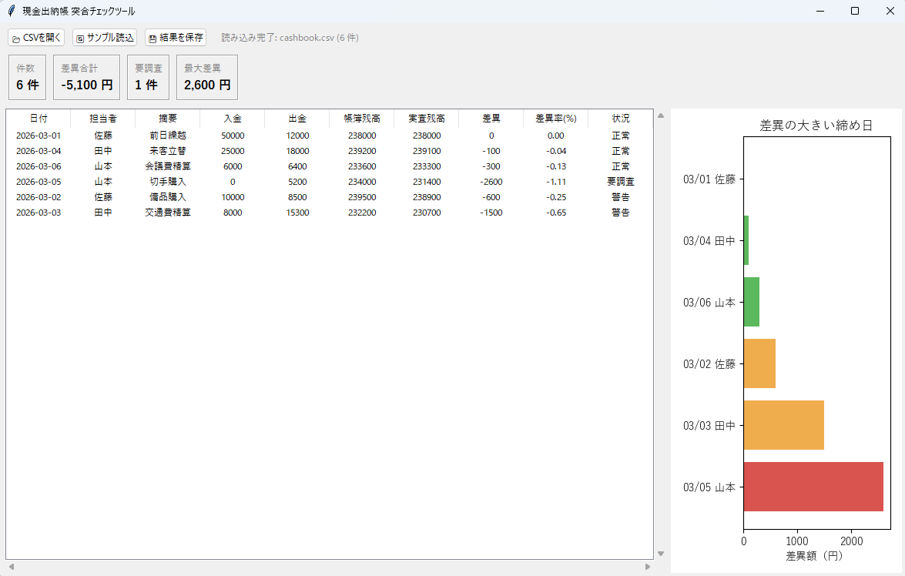
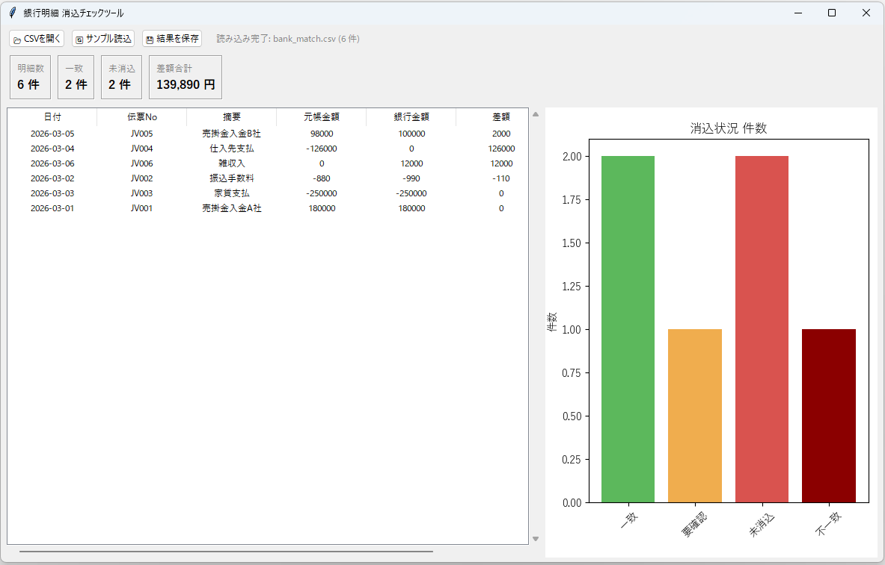
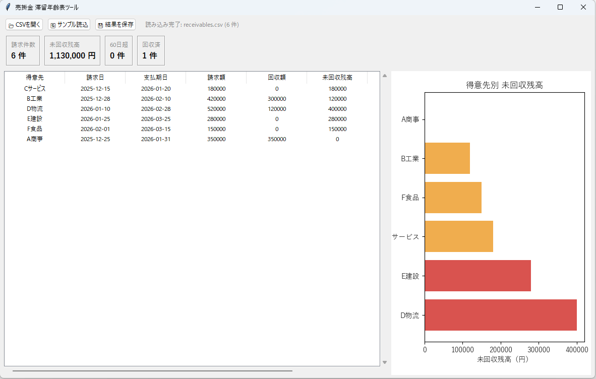
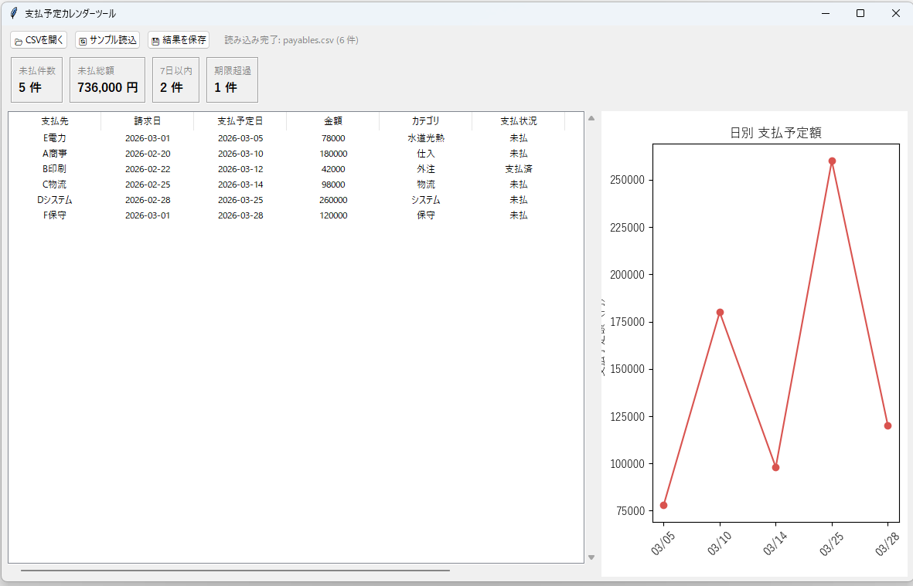
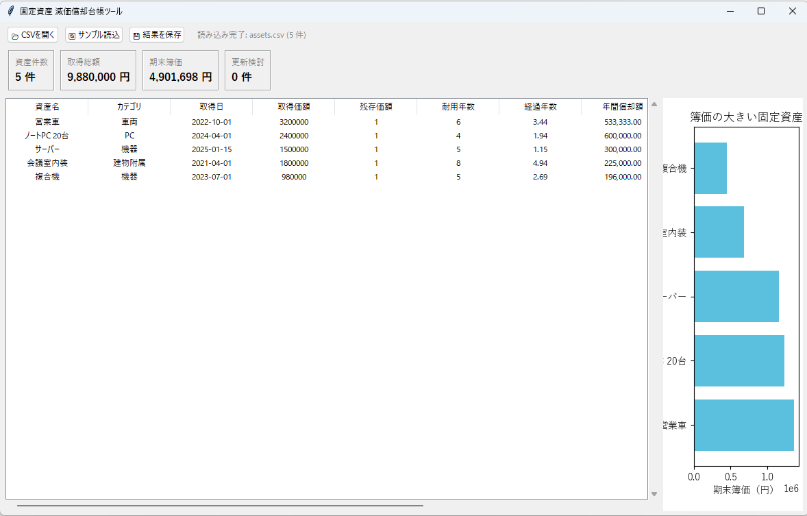
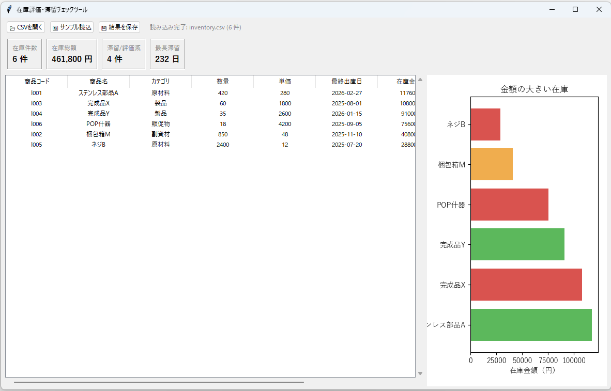
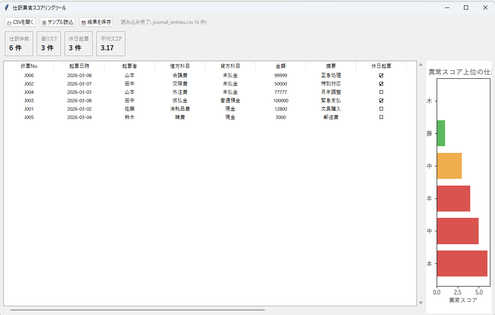
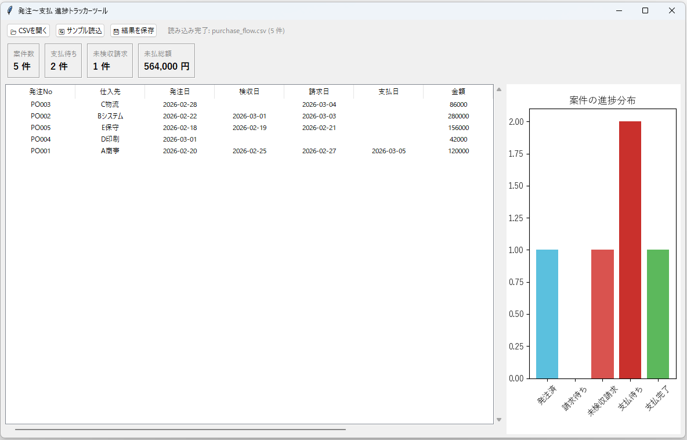
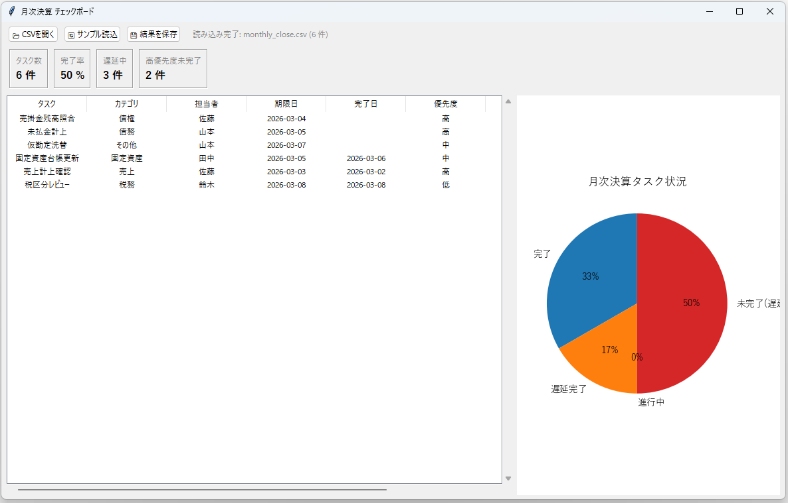
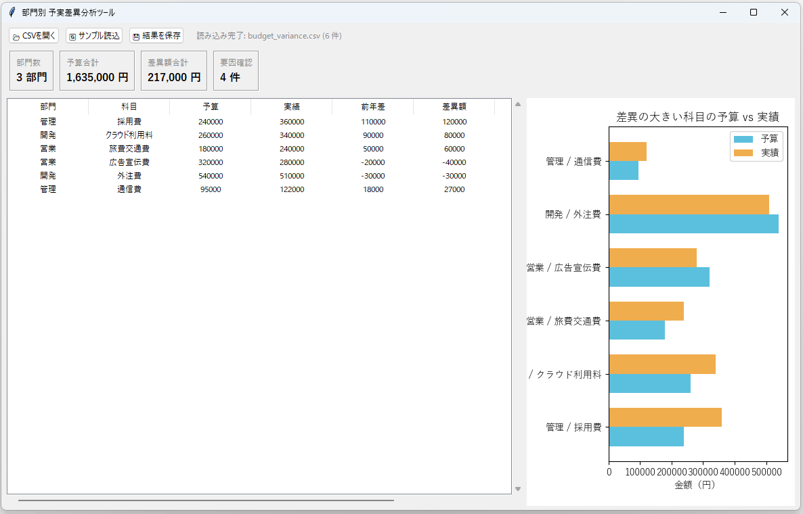

# Python Ledger デモアプリ集

会計・経理・監査の現場で使いやすい題材に寄せた Tkinter デスクトップアプリ 10本です。

`demo-audit-hr-samples` と同じく、各アプリは `main.py` に分析ロジック、`gui.py` に Tkinter UI を分離しています。

## 環境セットアップ

```powershell
python -m venv .venv
.venv\Scripts\Activate.ps1
pip install -r requirements.txt
```

## 起動方法

```powershell
cd 01_cashbook_reconciliation
python gui.py
```

## アプリ一覧

### 01 現金出納帳 突合チェックツール
**起動:** `cd 01_cashbook_reconciliation` → `python gui.py`

現金出納帳の帳簿残高と実査残高を比較し、過不足や差異の大きい締め日を洗い出すツール。



### 02 銀行明細 消込チェックツール
**起動:** `cd 02_bank_statement_matcher` → `python gui.py`

銀行明細と元帳の入出金を突合し、未消込や金額不一致を一覧表示するツール。



### 03 売掛金 滞留年齢表ツール
**起動:** `cd 03_accounts_receivable_aging` → `python gui.py`

請求日と支払期日から売掛金の滞留日数を算出し、回収遅延先を抽出するツール。



### 04 支払予定カレンダーツール
**起動:** `cd 04_accounts_payable_calendar` → `python gui.py`

買掛金や未払金の支払予定を日付順に並べ、支払集中日と遅延リスクを確認するツール。



### 05 固定資産 減価償却台帳ツール
**起動:** `cd 05_fixed_asset_depreciation` → `python gui.py`

固定資産台帳から定額法ベースの減価償却費、累計償却額、期末簿価を計算するツール。



### 06 在庫評価・滞留チェックツール
**起動:** `cd 06_inventory_valuation_checker` → `python gui.py`

在庫金額と最終出庫日から滞留在庫や評価減候補を洗い出すツール。



### 07 仕訳異常スコアリングツール
**起動:** `cd 07_journal_entry_anomaly_viewer` → `python gui.py`

起票日時や金額パターンから、監査上気になる仕訳をスコアリングして表示するツール。



### 08 発注〜支払 進捗トラッカーツール
**起動:** `cd 08_purchase_to_payment_tracker` → `python gui.py`

発注、検収、請求、支払の進捗を1行で見える化し、購買統制の抜け漏れを確認するツール。



### 09 月次決算 チェックボード
**起動:** `cd 09_monthly_close_checkboard` → `python gui.py`

月次決算タスクの期限と完了日を管理し、締め遅延や着手漏れを可視化するツール。



### 10 部門別 予実差異分析ツール
**起動:** `cd 10_department_budget_variance` → `python gui.py`

部門別・科目別の予算と実績を比較し、差異額と差異率の大きい項目を抽出するツール。



## ディレクトリ構造

```
[project root]/
├── README.md
├── requirements.txt
├── img/
├── 01_cashbook_reconciliation/
│   ├── main.py
│   ├── gui.py
│   ├── data/
│   └── results/
└── ...
```
